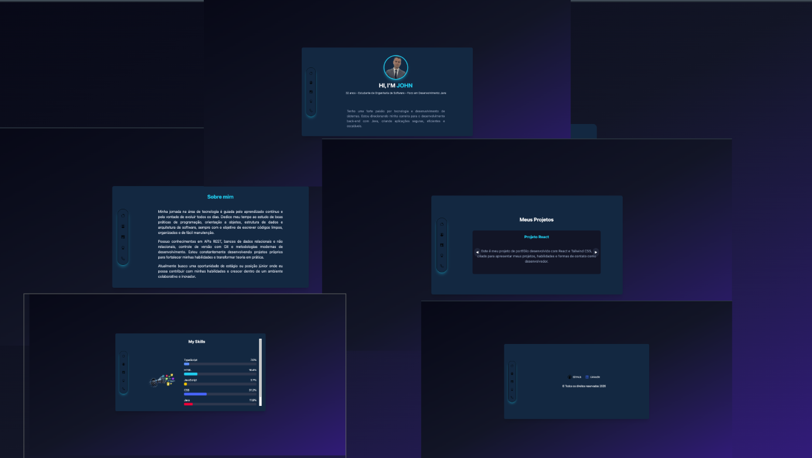

# 🚀 I´M JOHN — Página Pessoal Interativa

I´M JOHN é minha página pessoal desenvolvida com HTML, Tailwind CSS e JavaScript, criada para apresentar minha trajetória, habilidades e interesses de forma moderna e interativa.

O site reúne informações profissionais, mídia, gráficos em tempo real e recursos dinâmicos para proporcionar uma experiência completa ao usuário.

## 🧑‍💻 Sobre o Projeto

Este projeto funciona como um portfólio digital.
Apresento quem sou, minha jornada na tecnologia e alguns recursos visuais que demonstram minhas habilidades com desenvolvimento web.

Principais prioridades no desenvolvimento:

Código organizado e limpo

Interface moderna e responsiva

Experiência do usuário otimizada

## ✨ Funcionalidades
### ✅ Home

Apresentação pessoal

Descrição profissional

Links para LinkedIn e GitHub

Prévia de habilidades com sliders e gráficos

### ✅ Layout Responsivo

Totalmente adaptado para desktop, tablet e mobile

### ✅ Interatividade

Consumo de APIs externas

Animações com JavaScript e Tailwind

## 🛠️ Tecnologias Utilizadas

HTML5 — Estrutura da aplicação

Tailwind CSS — Estilização e layout responsivo

JavaScript (Vanilla) — Interatividade, sliders e integração com APIs

    📂 Estrutura do Projeto
    📁 projeto
     ├── index.html
     ├── src
     │   ├── css
     │   │    └── style.css
     │   ├── js
     │   │    └── script.js
     │   └── img
     │        └── preview.png
    🎯 Objetivo

Fortalecer habilidades em desenvolvimento web

Criar interfaces modernas e interativas

Demonstrar evolução prática como estudante de Engenharia de Software

## 📌 Melhorias Futuras

Adicionar mais seções ao portfólio

Implementar modo claro/escuro

Melhorar animações e microinterações

Otimizar performance

Publicar versão online

## 👨‍🚀 Autor

John Lima

Estudante de Engenharia de Software,

apaixonado por tecnologia e aprendizado contínuo.

🔗 LinkedIn

💻 GitHub

📄 Licença

Este projeto está sob a licença MIT.
Sinta-se livre para utilizar como inspiração ou base para seus próprios projetos.
